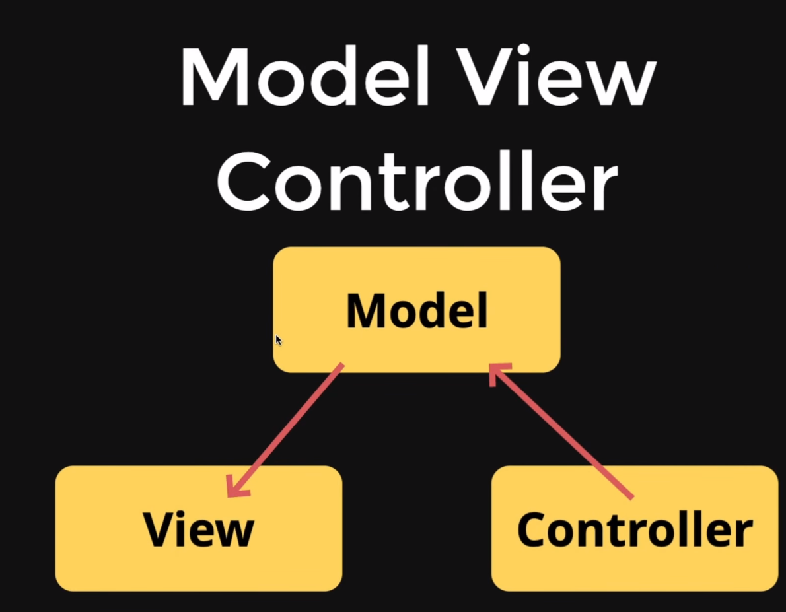

# Model View Controller

 - since our code can get bigger so to maintain it and enhance readablity we need MVC ( MVC is a refactoring style according to industry standards )

** Controller manipulates Model **
## And
** Model updates the View **