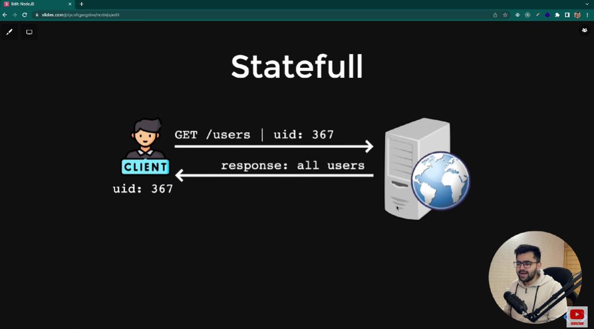
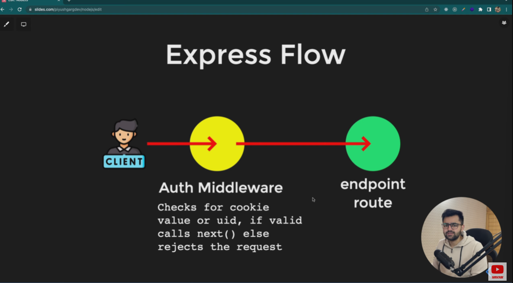
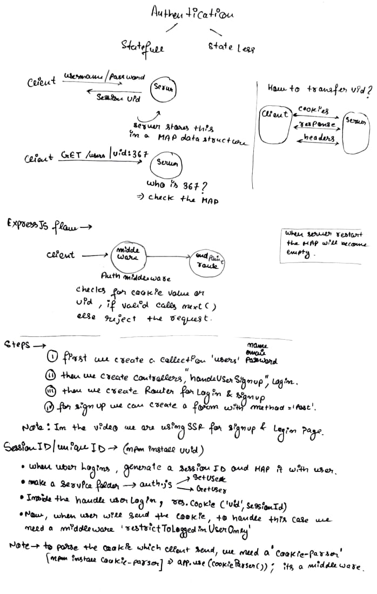

# Authentication

## Authentication Patterns
1. Statefull - Which maintains state or data on server side

2. Stateless - Which has no state.

In statefull authentication server works as a parking boy which stores the car no. with a unique mapped no.

Server gives the mapped number gives to the user as a parking ticket .

When user visit again to take the car the parking boy (server) maps the data , the user is authentic or not . If yes then server gives the permission to user to take the car.(maintain a state)




## How to transfer uid?

Server can transfer the unique id using cookies, respose , headers to the cilent.

## Express Flow



## 'ref' command in mongoose (below image is shown, is part of schema 'url')
[urls](./models/url.js)


The ref command is used so that we can apply the populate() function offered by mongoose.
Example--->
```
const Temp = await url.find({}).populate('createdBy');
console.log(Temp);
```
In the output we can see that the 'createdBy' is populated.

## workflow of this lecture (Statefull-authentication)

