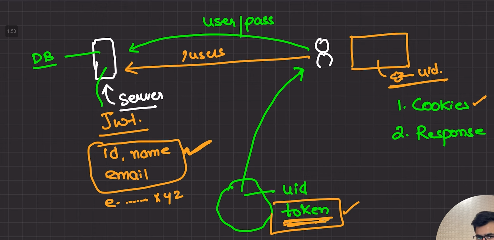

# Cookies in NodeJS

Server make the token.

Server can the send the token to the user through `Cookies` and `Response`.



## Using Browser - auto
Browser stores the cookies.

We can use the cookie to validate the user.

The server makes the cookies for the domain to which those cookies belong.`(Cookies are domain specific.)`

We can specify domain to the cookie. Which domain can acess that cookie.

We can also specify the expiration of the cookie.


```javascript 
res.cookie("uid", token , {
    domain : "ayushk.dev" // ayushk.dev can access 

    domain : ".ayushk.dev" // blog.ayushk.dev can access 
    //app.ayushk.dev also can access
})
```

It is only limited to the browser.

## Using Header - json

Cookies (used in browser-based authentication) are automatically handled by the browser and are sent along with each request to the server. However, mobile devices and mobile apps do not automatically manage cookies in the same way that browsers do.

In mobile applications, it's common to manually send the authentication token in the Authorization header of each HTTP request.


Bearer authentication is also called as token authentication. 
It is an `HTTP auth`.

```javascript
 Header{
     Authorization : Bearer <token>
 }

```
[Implementation_file](./middlewares/auth.js)

Server reads the header and removes the bearer and takes the token to validate the user.

